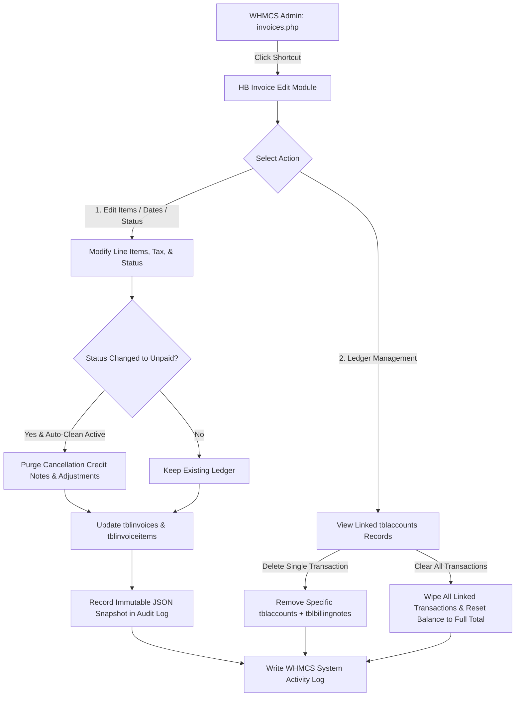

# HB WHMCS Invoice Editor & Ledger Manager

<p align="center">
  
  
  
  
  
</p>

---

## 📌 Overview

**HB WHMCS Invoice Editor & Ledger Manager** is an enterprise-grade addon module for WHMCS designed to give administrators full control over invoice corrections, line-item adjustments, tax recalibrations, and ledger cleanup.

Standard WHMCS invoice editing is often restrictive and prone to unintended side effects — particularly when reopening cancelled invoices where automatically generated **Credit Notes / Billing Adjustments** distort client balances and cause unwanted negative partial payment deductions (`-Rp / -$`) on Mass Payment checkouts.

**HB Invoice Edit** solves this by providing:
1. **Dynamic Line-Item & Pricing Modification** with realtime subtotal and tax calculation.
2. **Ledger & Credit Note Manager** to easily purge orphan adjustment records and restore 100% full invoice balance.
3. **Smart Revert to Unpaid Engine** that automatically cleans up cancellation adjustments when switching status back to Unpaid.
4. **Complete Audit Trail & Visual Diff (Before vs After)** storing immutable records of who edited what, when, and why.
5. **Seamless WHMCS Admin UI Integration** with 1-click shortcut buttons on native invoice pages.

---

## 🚀 Key Features

| Feature | Description |
| :--- | :--- |
| 📝 **Full Line-Item Editing** | Add, modify, or delete invoice line items, descriptions, amounts, and taxability dynamically. |
| 📅 **Backdate & Due Date Control** | Modify invoice issue dates and payment due dates without breaking recurrence cycles. |
| 🛡️ **Zero-Deduction Recovery** | Automatically purge residual Credit Notes (`tblbillingnotes`) and ledger adjustments (`tblaccounts`) when reverting invoices to Unpaid. |
| 🧹 **Direct Ledger Transaction Manager** | View all linked transaction IDs and remove locked adjustment credits directly with one click. |
| 🔍 **Audit Trail & Visual Diff** | Records every modification in `mod_hb_invoice_corrections_log` with JSON snapshots (Before vs After modal inspection). |
| 🔒 **Mandatory Correction Reasons** | Requires staff administrators to supply a reason for every adjustment, enforcing strict financial accountability. |
| ⚡ **One-Click Invoice Hook** | Injects an **"Edit Invoice (HB)"** button directly into the native WHMCS `invoices.php?action=edit` screen. |

---

## 🔄 Workflow Architecture & Alur Kerja



### Problem & Solution Alur Diagram

```
[ Traditional WHMCS Issue ]
Invoice #100 (Unpaid, Rp 100.000) 
  ──> Admin Sets to 'Cancelled' (WHMCS issues Credit Note #19 for -Rp 100.000)
  ──> Admin Changes back to 'Unpaid'
  ──> ❌ BUG: Balance becomes Rp 0,00 and Mass Payment shows "-Rp 100.000 Partial Payment"

[ HB Invoice Edit Solution ]
Invoice #100 in HB Invoice Edit
  ──> Admin Selects 'Unpaid' + [✓] Auto Clean Adjustments
  ──> 🛡️ HB Engine automatically removes orphan Credit Note & tblaccounts adjustment
  ──> ✅ SUCCESS: Status is Unpaid, Balance is Rp 100.000 (Full), Mass Payment is Clean!
```

---

## 🗄️ Database Modifications & Schema Impact

This module interacts with native WHMCS tables safely via the WHMCS Database Capsule (Laravel Eloquent Query Builder) and introduces one dedicated audit log table.

### 1. New Custom Table: `mod_hb_invoice_corrections_log`
Created automatically upon module activation.

| Column | Type | Description |
| :--- | :--- | :--- |
| `id` | `INT(10) AUTO_INCREMENT` | Primary key |
| `invoice_id` | `INT(11)` | Target WHMCS Invoice ID (`tblinvoices.id`) |
| `client_id` | `INT(11)` | Client User ID (`tblclients.id`) |
| `client_name` | `VARCHAR(150)` | Cached client full name for fast reporting |
| `admin_user` | `VARCHAR(50)` | Username of the administrator executing the change |
| `old_total` | `DECIMAL(10,2)` | Invoice total prior to correction |
| `new_total` | `DECIMAL(10,2)` | Invoice total after correction |
| `reason` | `TEXT` | Mandatory justification entered by admin |
| `old_snapshot` | `LONGTEXT (JSON)` | Full serialized state of invoice + line items before edit |
| `new_snapshot` | `LONGTEXT (JSON)` | Full serialized state of invoice + line items after edit |
| `ip_address` | `VARCHAR(50)` | Admin remote IP address |
| `created_at` | `TIMESTAMP` | Timestamp of modification |

### 2. Modified Native WHMCS Tables

| Table | Operation | Impact & Safe Handling |
| :--- | :--- | :--- |
| `tblinvoices` | `UPDATE` | Updates `date`, `duedate`, `status`, `paymentmethod`, `subtotal`, `tax`, `taxrate`, `total`, `updated_at`. |
| `tblinvoiceitems` | `DELETE` & `INSERT` | Rebuilds line items cleanly for the specific `invoiceid` to ensure total mathematical consistency. |
| `tblaccounts` | `DELETE` *(Conditional)* | Deletes specific adjustment records (`type = 'invoice_billing_adjustment_credit'`) or cleared transactions when explicitly requested by admin. |
| `tblbillingnotes` | `DELETE` *(Conditional)* | Cleans orphan Credit Note headers linked via `billingnoteid`. |
| `tblbillingnoteitems`| `DELETE` *(Conditional)* | Cleans orphan Credit Note item entries linked via `billingnote_id`. |

---

## 💻 System Requirements

* **WHMCS**: `v8.0.0` through `v9.x` (Tested & fully compatible)
* **PHP**: `7.4`, `8.0`, `8.1`, `8.2`, `8.3`, `8.4`
* **Database**: `MySQL 5.7+` or `MariaDB 10.3+`
* **PHP Extensions**: `PDO`, `pdo_mysql`, `json`, `mbstring`
* **WHMCS Admin Permissions**: Full Administrator or Addon Modules access privileges

---

## 📦 Installation & Setup

### Step 1: Upload Files
Upload the `hb_invoice_editor` folder to your WHMCS addons directory:
```bash
/path/to/whmcs/modules/addons/hb_invoice_editor/
├── hb_invoice_editor.php
├── hooks.php
├── README.md
└── LICENSE
```

### Step 2: Activate in WHMCS Admin
1. Log in to your **WHMCS Admin Area**.
2. Navigate to **System Settings** (🔧) > **Addon Modules** (or **Setup > Addon Modules** in WHMCS 7/8).
3. Locate **HB Invoice Edit** and click **Activate**.
4. Click **Configure** to grant access permissions to your Administrator Role Groups (e.g. *Full Administrator*).

### Step 3: Access the Module
* Access directly via **Addons > HB Invoice Edit**.
* Or open any invoice in **Billing > Invoices > Edit Invoice** and click the **"Edit Invoice (HB)"** button in the header.

---

## 🛡️ Security & Quality Standards

* **CSRF Protection**: All form submissions and state mutations are guarded with WHMCS native token verification (`check_token('WHMCS.admin.default')`).
* **Prepared Statements**: All database operations utilize `WHMCS\Database\Capsule` to guarantee zero SQL injection vulnerability.
* **Granular Audit Logging**: Double-layer logging in both the internal database table and WHMCS native `logActivity()`.
* **Zero External Dependencies**: Pure standalone PHP/JS module without external CDN trackers or heavy vendor bundles.

---

## 📄 License

This project is open-source software licensed under the **[MIT License](LICENSE)**.

---

<p align="center">
  Crafted with ❤️ by <strong>HB Dev Team</strong> for the WHMCS Community.
</p>
